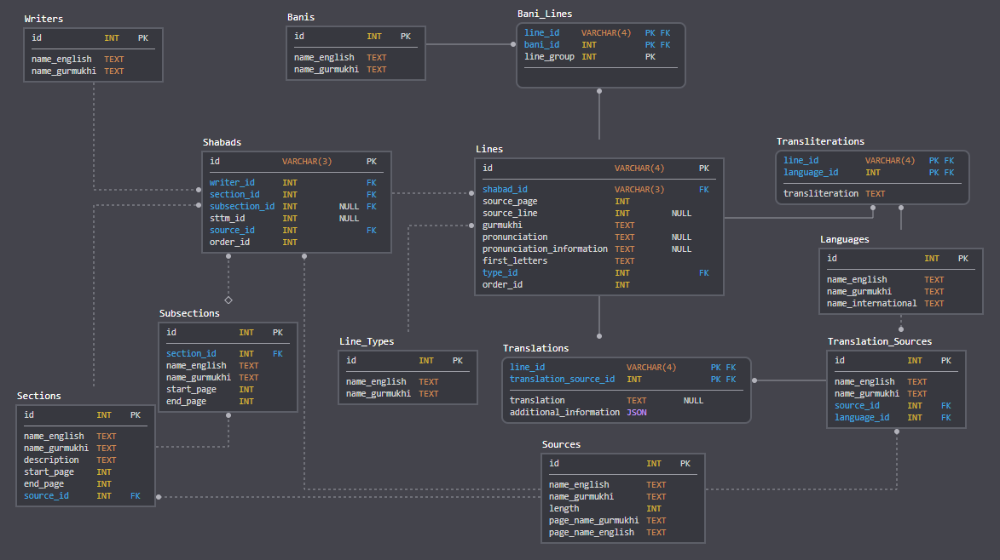
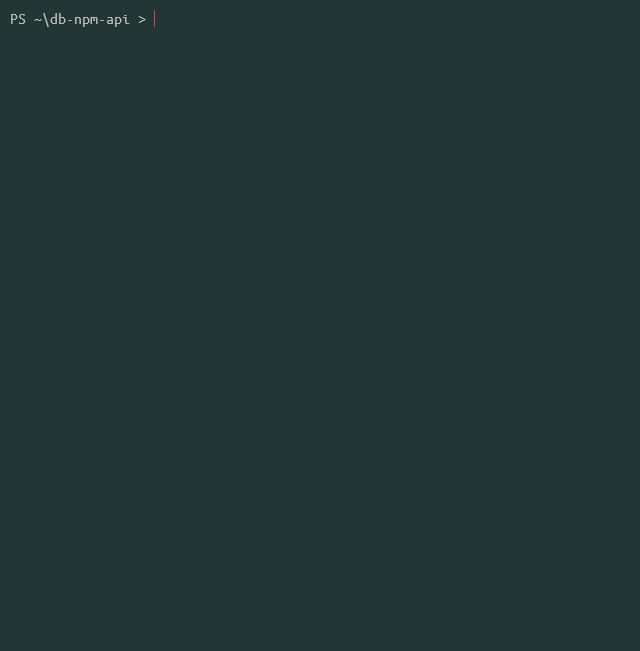

# Database

> [!NOTE]
> This is the next major version of the database. Documentation is currently being updated.

A digital representation of Sikh Bani and other Panthic texts with a public logbook of sangat-sourced corrections.

[![NPM Version][npm-image]][npm-url]
[![NPM Downloads][downloads-image]][downloads-url]
[![Release][release-image]][release-url]
[![Next Release][next-image]][next-url]

**Table of Contents**

- [Introduction](#introduction)
  - [Features](#features)
  - [Screenshots](#screenshots)
    - [Proofreading Flow [GIF]](#proofreading-flow-gif)
    - [Database Schema Layout](#database-schema-layout)
    - [NPM JS package API [GIF]](#npm-js-package-api-gif)
- [Community](#community)
- [Contributing](#contributing)
- [People](#people)
- [Feedback](#feedback)
- [Related Projects](#related-projects)
- [Code of Conduct](#code-of-conduct)
- [License](#license)
- [Gurbani and Panthic Compositions](#gurbani-and-panthic-compositions)
  - [Sri Guru Granth Sahib Ji](#sri-guru-granth-sahib-ji)
  - [Sri Dasam Granth](#sri-dasam-granth)
  - [Bhai Gurdaas Ji](#bhai-gurdaas-ji)
  - [Bhai Nand Laal Ji](#bhai-nand-laal-ji)
- [Acknowledgments](#acknowledgments)

## Introduction

Shabad OS Database is an open source project with ongoing development, project management, and marketing made possible entirely by the support and dedication of unpaid volunteers.

### Features

- Open-source
  - Content, history, and modifications are publicly accessible
  - Transparency through open-source is more accountable (i.e. anyone can verify integrity)
  - Duplication of effort among different parties is reduced
  - Sustainability and longevity of project is improved
- Quality / Accuracy
  - Backed by real, physical sources (no controversy)
  - Digitally represents what was written/printed
  - Photographic evidence continuously reviewed for accuracy
  - Multiple sources used to digitize gurbani, panthic texts, language translations, and exegesis
- Modern database schema
  - Designed to capture data effectively
  - Ideal for developing apps, analyzing data, or undertaking research
- API
  - The `@shabados/database` npm JS package can query the database without SQL

### Screenshots

#### Proofreading Flow [GIF]

Shabad OS Database follows a high-quality, publicly accessible, verifiable, and accountable proofreading process. The following GIF contains:

1. [PR for Ganj Nama](https://github.com/ShabadOS/database/pull/1253)
2. [Git diff of all changes](https://github.com/ShabadOS/database/pull/1253/files)
3. [Commit message with citation](https://github.com/ShabadOS/database/pull/1253/commits/7d90070a31b4d5ef4446d8f45a642c68bf5b8da5))


#### Database Schema Layout

This image may be out of date. [View the schema on SQLDBM](https://app.sqldbm.com/MySQL/Share/pNAqT007VSFLHnCdfAc9NkGFrngIE8md_DYjF4jNYw0) for the most up-to-date file.



#### NPM JS package API [GIF]

Example of querying database without SQL:



## Community

Get updates on Shabad OS and chat with the project maintainers and community members.

- [![Instagram][instagram-image]][instagram-url] Follow Shabad OS on Instagram
- [![Twitter][twitter-image]][twitter-url] Follow Shabad OS on Twitter.
- [![Chat][chat-image]][chat-url] Join the official Slack channel.

## Contributing

There are multiple ways to contribute whether you are a user or developer. For example:

- Review physical sources and compare them to what has been digitized. [Learn more about proofreading >](https://tutorials.shabados.com/tutorials/1.0.0/database-viewer/proofreading.html)
- Submit proofreading tickets. Help us verify whether they are legit. [Explore our proofreading issue tracker >](https://github.com/ShabadOS/database/issues)
- [Submit bugs and feature requests][new-issue-url].
- Review documentation and make pull requests for anything from typos to new content.
- Give feedback on the onboarding process to make it easier for others to join the project.

If you're interested in contributing to the source code of Database, then please see [Contributing Guidelines](CONTRIBUTING.md).

## People

The original code was written by the current lead maintainer, Harjot Singh ([@harjot1singh](https://github.com/harjot1singh)).

"Thank you!" to [all the volunteers][contributor-url] who've contributed to Database.

## Feedback

- Ask questions and get help in our community chat via [Slack][chat-url]
- [Upvote popular feature requests][upvote-tracker-url] using the thumbs-up/+1 reaction on the first post of a feature request
- Follow [@shabad_os on Instagram](instagram-url) and [@shabad_os on Twitter](twitter-url) and let us know what you think!

## Related Projects

Projects in the Shabad OS ecosystem of free and open source software include:

- [Viewer](https://github.com/shabados/viewer)
- [Presenter](https://github.com/shabados/presenter)
- [Mobile](https://github.com/shabados/mobile)
- [Gurmukhi Utils](https://github.com/shabados/gurmukhi-utils)

## Code of Conduct

Please note that this project is released under the Contributor Covenant. By participating in this project you agree to abide by its terms. Our intention is to signal a safe open-source community by welcoming all people to contribute, and pledging in return to value them as whole human beings and to foster an atmosphere of kindness, cooperation, and understanding.

> We as members, contributors, and leaders pledge to make participation in our community a harassment-free experience for everyone, regardless of age, body size, visible or invisible disability, ethnicity, sex characteristics, gender identity and expression, level of experience, education, socio-economic status, nationality, personal appearance, race, religion, or sexual identity and orientation.
>
> We pledge to act and interact in ways that contribute to an open, welcoming, diverse, inclusive, and healthy community.
>
> [The Contributor Covenant][contributor-covenant-url]

## License

> [!NOTE]
> Applies to code and content resting outside of the `data` folder.

The code under this project falls under the [MIT License](LICENSE.md).

> Copyright (c) Shabad OS Organization and Contributors
>
> Permission is hereby granted, free of charge, to any person obtaining a copy of this software and associated documentation files (the "Software"), to deal in the Software without restriction, including without limitation the rights to use, copy, modify, merge, publish, distribute, sublicense, and/or sell copies of the Software, and to permit persons to whom the Software is furnished to do so, subject to the following conditions:
>
> The above copyright notice and this permission notice shall be included in all copies or substantial portions of the Software.
>
> THE SOFTWARE IS PROVIDED "AS IS", WITHOUT WARRANTY OF ANY KIND, EXPRESS OR IMPLIED, INCLUDING BUT NOT LIMITED TO THE WARRANTIES OF MERCHANTABILITY, FITNESS FOR A PARTICULAR PURPOSE AND NONINFRINGEMENT. IN NO EVENT SHALL THE AUTHORS OR COPYRIGHT HOLDERS BE LIABLE FOR ANY CLAIM, DAMAGES OR OTHER LIABILITY, WHETHER IN AN ACTION OF CONTRACT, TORT OR OTHERWISE, ARISING FROM, OUT OF OR IN CONNECTION WITH THE SOFTWARE OR THE USE OR OTHER DEALINGS IN THE SOFTWARE.

## Gurbani and Panthic Compositions

> [!NOTE]
> Applies to different texts inside the `data` folder, generated inside the `build` folder, and as releases (e.g. GitHub, npm).

As typical of many old, historical works, most gurbani and panthic texts are free of known copyright restrictions. We identify it as being in the [public domain](https://creativecommons.org/publicdomain/mark/1.0/) as a work of factual compilation with originality. The honor and reputation of the original works are to be maintained. Derogatory treatments (including adding to, deleting from, altering of, or adapting) the words in a way that distorts or mutilates the original work is forbidden. That is why, whenever possible, physical sources are used to determine the digital representation of these works as to avoid any controversy.

Citations for accuracy and review are based on MLA formatting. More often than not, a condensed version of the following is used when citing changes to any of the sources in the database:

```shell
Author. Title of source. Title of container, Other contributors, Version, Number, Publisher, City of Publication, Publication Date, Location. Date of access.
```

### Sri Guru Granth Sahib Ji

```shell
Shabadaarth. Vol. 1-4, SGPC, Sri Amritsar, 2009-2012, www.archive.org/details/ShabdaarthSriGuruGranthSahibJi-Part1. Accessed 22 Jan 2019.
```

Vishraam / Pauses:

```shell
Dauder, Jaswant S. Sri Guru Granth Sahib Ji Shudh Ucharan, Arth Paath Vishraam Pothi, Sri Damdami Taksaal. Oct 2015, www.gursevak.com/drupal7/sites/default/files/Vishram%20Sri%20Guru%20Granth%20Sahib%20Jee.pdf. Accessed 18 May 2020.
```

Arth / Translations:

```shell
Singh, Sahib. Sri Guru Granth Darpan. Vol. 1-10, Raaj Publishers, Hoshiarpur/Jalandhar, 1972, www.archive.org/details/SriGuruGranthSahibDarpan-Volume1. Accessed 18 May 2020.

Singh, Badan. Fridkot Wala Teeka. Bh. Baljinder Singh Rara Sahib, www.ik13.com/PDFS/Fridkot_Wala_Teeka.pdf. Accessed 24 May 2020.

Singh, Manmohan. Sri Guru Granth Sahib (English & Punjabi Translation). Vol 1-8, 6th & 8th ed., SGPC, Amritsar, 2006-2009. www.archive.org/details/SriGuruGranthSahibEnglishAndPunjabiTranslation-Vol.1. Accessed 24 May 2020.
```

### Sri Dasam Granth

ਜਾਪੁ ਸਾਹਿਬ, ਤ੍ਵ ਪ੍ਰਸਾਦਿ ਸਵਯੇ (ਸ੍ਰਾਵਗ ਸੁਧ), ਕਬਿਯੋਬਾਚ ਬੇਨਤੀ ਚੌਪਈ, ਤ੍ਵ ਪ੍ਰਸਾਦਿ ਸ੍ਵਯੇ (ਦੀਨਨ ਕੀ), ਚਉਬੀਸ ਅਵਤਾਰ (Ending Savaiya and Dohira), ਵਾਰ ਸ੍ਰੀ ਭਗਉਤੀ ਜੀ ਕੀ (First Pauri):

```shell
Nitnem Te Hor Baniaa(n). SGPC, Sri Amritsar, May 2017, www.drive.google.com/open?id=1AyQLCQgrNznDxI9Vby3knE4Piyrdsnxs. Accessed 22 Jan 2019.
```

ਸ਼ਬਦ ਹਜ਼ਾਰੇ ਪਾਤਿਸ਼ਾਹੀ ੧੦, ਅਕਾਲ ਉਸਤਤ, ਬਚਿਤ੍ਰ ਨਾਟਕ, ਚੰਡੀ ਚਰਿਤ੍ਰ ਉਕਤਿ ਬਿਲਾਸ, ਚੰਡੀ ਚਰਿਤ੍ਰ, ਵਾਰ ਸ੍ਰੀ ਭਗਉਤੀ ਜੀ ਕੀ, ਗਿਆਨ ਪ੍ਰਬੋਧ:

```shell
Das Granthi. SGPC, Sri Amritsar, Jul 2014.

Das Granthi. SGPC, Sri Amritsar, Mar 2006, www.sikhbookclub.com/Book/Das-Granthi. Accessed 22 Jan 2019.
```

Zafarnama:

```shell
Padam, Piara S. Zafarnama. 6th ed., Singh Brothers, Amritsar, Sep 2013, www.archive.org/details/ZafarnamaTePanjHorNamae. Accessed 22 Jan 2019.
```

Rest:

```shell
Dasam Sri Guru Granth Sahib Ji. Vol. 1-2, Baba Teja Singh Ji Nihung Singh Mehron Wale, Moga Punjab, 2011.

Ramgarhia, Eshar S. Dasam Sri Guru Granth Sahib Ji Shiromani Steek. 1st ed., Vol. 1-6, Baba Teja Singh Ji Nihung Singh Mehron Wale, Moga Punjab, Vaisakhi 1999, www.archive.org/details/DasamSriGuruGranthSahibJiShiromaniSteek1. Accessed 22 Jan 2019.
```

Arth / Translation:

```shell
Jaggi, Ratan S. Sri Dasam Granth. Gobind Sadan, New Delhi, www.gobindsadan.org/download/148/siri-dasam-granth/1363/dasam-granth-complete.pdf. Created 15 Sep 2007. Uploaded 02 Nov 2017. Accessed 22 Jan 2019.
```

### Bhai Gurdaas Ji

```shell
Ashok, Shamsher S, and Chakar, Amar S. Varan Giaan Ratnaavli Bhai Gurdaas Ji. SGPC, Sri Amritsar, Nov 2011, www.vidhia.com/Bhai%20Gurdaas%20Ji/Vaaran%20Bhai%20Gurdaas%20Ji%20-%20SGPC.pdf. Accessed 22 Jan 2019.

Amrit Keertan. 40th ed., Khalsa Brothers, Amritsar, Jul 2011, www.archive.org/details/AmritKirtan_226. Accessed 22 Jan 2019.

Singh, Sewa. Kabit Sawaiye Bhai Gurdas Ji Steek. 7th ed., Singh Brothers, Amritsar, Dec 2011, www.archive.org/details/KabitSavaiyeBhaiGurdasJiSteek. Accessed 22 Jan 2019.
```

Teeka / Translation:

```shell
Singh, Vir. Varan Bhai Gurdas Steek. 22nd ed., New Delhi, Jul 2012, www.archive.org/details/VaraanBhaiGurdasSteek-BhaiVirSingh. Accessed 18 May 2020.

Singh, Jodh. Vārān Bhāī Gurdās (Text, Transliteration, and Translation). Vol. 1-2, 2nd ed., B. Chattar Singh Jiwan Singh, Amritsar, 2013, www.archive.org/details/VaraanBhaiGurdasTextTransliterationAndTranslation-Vol1. Accessed 18 May 2020.
```

### Bhai Nand Laal Ji

Ghazals, Zindagi Nama, Ganj Nama, Jot Bigas (Punjabi & Farsi), Rehit Nama, Tankah Nama, Dasturul-Insa, Arjul-Alfaz, Tausifo-Sana, Khatima and their Punjabi Translations:

```shell
Singh, Ganda. Bhai Nand Lal Granthavali. 4th ed., Punjabi University, Patiala, 2009, www.archive.org/details/BhaiNandLalGranthavali. Accessed 22 Jan 2019.
```

English Translations:

```shell
Kalaam-e-Goya. Translated by Pritpal S Bindra, Institute of Sikh Studies, Chandigarh, 2003
```

## Acknowledgments

**NOTE**: If we have missed any attribution, credits, or copyrights, please [let us know][new-issue-url] or fork this repo and submit a [pull request](CONTRIBUTING.md).

Though unmentioned in the bibliography of sources above, the following are acknowledged for their work in pioneering the digitization process of gurbani, translations, and pronunciations:

- Dr. Kulbir S Thind
- SHARE Charity UK

[npm-image]: https://img.shields.io/npm/v/@shabados/database.svg
[npm-url]: https://npmjs.org/package/@shabados/database
[downloads-image]: https://img.shields.io/npm/dm/@shabados/database.svg
[downloads-url]: https://npmcharts.com/compare/@shabados/database?minimal=true
[release-image]: https://img.shields.io/circleci/build/github/shabados/database/master.svg?label=release
[release-url]: https://app.circleci.com/pipelines/github/shabados/database?branch=master
[next-image]: https://img.shields.io/circleci/build/github/shabados/database/dev.svg?label=next%20release
[next-url]: https://app.circleci.com/pipelines/github/shabados/database?branch=dev
[website-url]: https://shabados.com
[instagram-image]: https://img.shields.io/badge/Instagram-%40shabad__os-C13584.svg?logo=instagram&logoColor=white
[instagram-url]: https://www.instagram.com/shabad_os/
[twitter-image]: https://img.shields.io/badge/Twitter-%40shabad__os-1DA1F2.svg?logo=twitter&logoColor=white
[twitter-url]: https://www.twitter.com/shabad_os/
[chat-image]: https://img.shields.io/badge/Chat-Public%20Slack%20Channels-1264a3.svg?logo=slack
[chat-url]: https://chat.shabados.com
[new-issue-url]: https://github.com/shabados/database/issues/new/choose
[contributor-url]: https://github.com/shabados/database/graphs/contributors
[upvote-tracker-url]: https://github.com/shabados/database/issues?q=is%3Aopen+is%3Aissue+label%3A%22Type%3A+Feature%2FEnhancement%22+sort%3Areactions-%2B1-desc
[contributor-covenant-url]: https://www.contributor-covenant.org/version/2/0/code_of_conduct/
