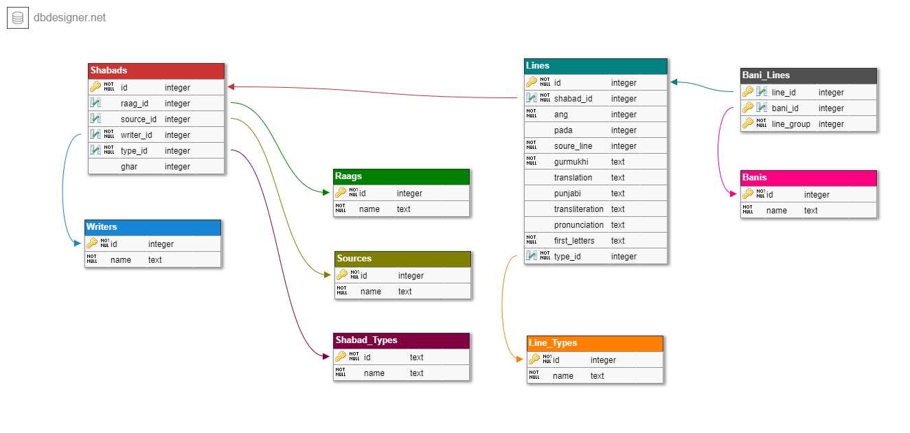

# Shabad OS Database

<div align="center">
  
</div>
<br/>
<div align="center">

A digital representation of Sikh Bani and other Panthic texts with a public logbook of sangat-sourced corrections.

[](https://circleci.com/gh/ShabadOS/database)
[](https://github.com/ShabadOS/database/releases)
[](https://www.npmjs.com/package/@shabados/database)
[]()
[]()
<br/>
[](mailto:team@shabados.com) [](https://wa.me/15166196059) [](https://slack.shabados.com)
<br/>
**[Full Docs](https://shabados.github.io/database)**
</div>

# Table of Contents

- [Shabad OS Database](#shabad-os-database)
- [Table of Contents](#table-of-contents)
- [Getting Started](#getting-started)
- [Schema & File Structure](#schema--file-structure)
- [Build](#build)
  - [Database](#database)
  - [JSON](#json)
- [Contributing](#contributing)
  - [Folder structure](#folder-structure)
- [Releases](#releases)
- [Benchmarks](#benchmarks)
- [Viewers](#viewers)
- [Licenses](#licenses)

# Getting Started

Install the database with `npm install @shabados/database`. An [`objection.js`](http://vincit.github.io/objection.js/) object is returned, allowing for flexible and relational querying. To fetch a Shabad with first letters:

```javascript
// const { Lines } = require('./index') // If using this repo
const { Lines } = require('@shabados/database') // If using npm module
    
// Fetch the line, with information about the shabad
Lines
  .query() // Start a query on the lines table
  .firstLetters('ਹਹਹਗ')   // Search for the first letters, ordering the results sensibly
  .first()  // Use the first line that is returned
  .then(line => line.$relatedQuery('shabad').eager('[lines, writer]'))  // Return the shabad the line is from, with the lines and writer
  .then(shabad => console.log(shabad))
```

To search in the ascii equivalent, the API will automatically convert the search to unicode:

```javascript
Lines.query().firstLetters('kkggAnj')
```

> Although column names are in `snake_case`, the API returns `camelCase` via [objection.js](http://vincit.github.io/objection.js/#snake-case-to-camel-case-conversion).

# Schema & File Structure



The schema can be modified in the `migrations/schema.js` file.

JSON files for `Raags`, `Sources`, `Writers`, and `Line_Types` can be found in the `data` folder. Changing a value here will be reflected everywhere else. The `(array index) + 1` represents the id used for each relation in other tables.

Lines of JSON files are split by page or other sensible method via `./data/source/number.json`.

Bani compilations can be added to the `bani.json`. To define the lines it contains, each bani should contain a list of objects with `start_line` and `end_line`, referring to the files in `sources`.

# Build

It is possible to make small changes and build a database from the JSON files and in reverse to make batch changes and build the JSON files from the database.

## Database

You can build an SQLite3 database with the following methods:

**Node.js** - Install [node](https://nodejs.org/). Install dependencies and build with `npm install && npm run build-sqlite`.

**Docker** - Install [docker](http://docker.com). Build with `docker-compose up build-sqlite`. Check the `build` folder.

## JSON

> Instead of making bulk changes to JSON files as a pull request, we highly urge you to submit an issue of the change first instead for visibility and security.

It is best practice to build the database, make changes to `database.sqlite`, and regenerate JSON files with the following methods:

**Node.js** - `npm run build-json`

**Docker** - `docker-compose up build-json`

# Contributing

By making a pull request of changes to the `data` folder, others can submit spelling mistakes, grammar errors, and translation improvements. Format for errors should follow the guideline for git commits:

```
Subject: What for/in Line XXXX

Description:
From where did you source the information (Include title, year, and other pertinent information for 3rd parties).
(Optional) Why was the information incorrect in our db (e.g. mistake inherited from 2014 iGurbani db or mistake found in 2008 Sttm2 db).
```

We also have the [Shabad OS Database viewer](https://database.shabados.com), which can be used to view the database and autofill issues! 

## Folder structure

The `data` folder is the source of truth for any builds.

* *Source folders* - `.json` files contain the id, gurmukhi, pronunciation, and translations of each line of parent folder's source
* *`.json` files* - these files range from compiling banis, separating sections and sub-sections, to naming languages, translations, and writers

# Releases

The builds for any of branches can be found on [CircleCI](https://circleci.com/gh/ShabadOS).

If `#Major`, `#Minor`, `#Patch` are found in the latest commit messages, database assets will be compiled and released per semantic versioning.

Compiled databases are available via the release page, or via `npm install @shabados/database`.

# Benchmarks

Run benchmarks with `npm run benchmark` or `docker-compose up benchmark`. Benchmarks depend on specs, but the following shows that between 0-200 results can be returned in a reasonable amount of time.

Query | Results | Time
----- | ------- | ----
ਹਹ | 2748 | ~80ms
ਹਹਹ | 226 | ~50ms
ਹਹਹਹ | 50 | ~50ms
ਹਹਹਹਹ | 13 | ~50ms

# Viewers

You can use an application like [DBeaver](https://dbeaver.jkiss.org/) to view the SQLite file.

# Licenses

Gurbani was written during a time and place without formal copyright laws. Therefore we identify it as being free of known restrictions under copyright law. Gurbani under the `data` folder and generated under the `build` folder, including the `gurmukhi` JSON and SQLite fields, is free of copyright and in the [Public Domain](https://creativecommons.org/publicdomain/mark/1.0/).

Supporting text under the `data` folder and generated under the `build` folder, are subject to their respective source copyrights, some by other authors. Translations, transliterations, notes, compilations, or other items which are not Gurbani and which are created or uniquely organized by the Shabad OS team are subject to the [Creative Commons Attribution-ShareAlike 4.0 International License](http://creativecommons.org/licenses/by-sa/4.0/).

All code and content resting outside of the `data` and `build` folders is licensed under the [GNU General Public License v3](https://www.gnu.org/licenses/gpl.html).
